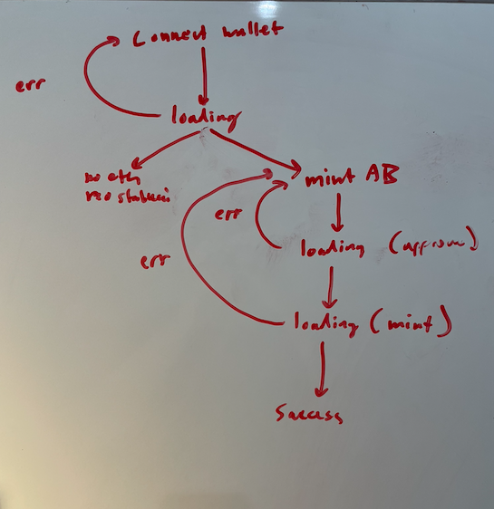

# AlgoBull Web App

A web front-end for supporting interactions with the [AlgoBull contract](https://github.com/ANDREWBTC707/-ALGOBULL).

## Project Plan
- [ ] Connect Wallet UX
  - [ ] Failure Dialogue
    - [ ] Network is not supported
  - [ ] Button
- [ ] Form UX
  - [ ] Failure Dialogue 
  - [ ] Mint button
  - [ ] Quantity field
  - [ ] Token balance
    - [ ] If not balance, don't show.
    - [ ] Else show balance and scan link.
- [ ] Loading UX with spinner
- [ ] 
- [ ] Minted UX with a quantity received and scan link.
- [ ] Design should be branded consistently with https://www.algobull.art/
- [ ] Should implement state machine
  

## To Run it
```
elm-app start
```

